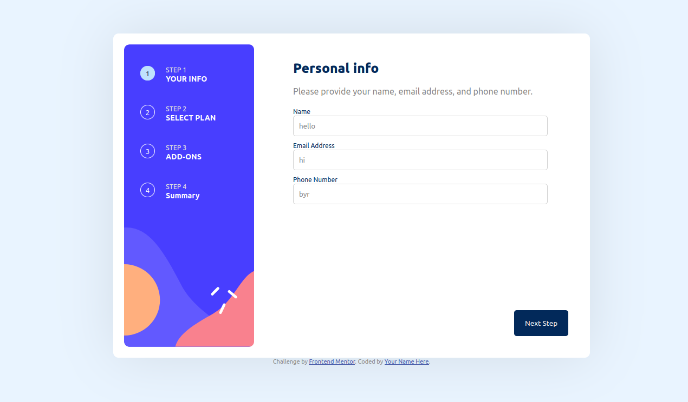

# Frontend Mentor - Multi-step form solution

This is a solution to the [Multi-step form challenge on Frontend Mentor](https://www.frontendmentor.io/challenges/multistep-form-YVAnSdqQBJ). Frontend Mentor challenges help you improve your coding skills by building realistic projects. 

## Table of contents

- [Overview](#overview)
  - [The challenge](#the-challenge)
  - [Screenshot](#screenshot)
  - [Links](#links)
- [My process](#my-process)
  - [Built with](#built-with)
  - [What I learned](#what-i-learned)
  - [Continued development](#continued-development)

**Note: Delete this note and update the table of contents based on what sections you keep.**

## Overview

### The challenge

Users should be able to:

- Complete each step of the sequence
- Go back to a previous step to update their selections
- See a summary of their selections on the final step and confirm their order
- View the optimal layout for the interface depending on their device's screen size
- See hover and focus states for all interactive elements on the page
- Receive form validation messages if:
  - A field has been missed
  - The email address is not formatted correctly
  - A step is submitted, but no selection has been made

### Screenshot

### Links

- Solution URL: [Add solution URL here](https://github.com/AbenezerWork/Multi-step-form-frontend-mentor)
- Live Site URL: [Add live site URL here](https://multi-step-form-frontend-mentor-eta.vercel.app/)

## My process

### Built with

- Semantic HTML5 markup
- SASS custom properties
- Flexbox
- CSS Grid
- Mobile-first workflow

### What I learned

This was my biggest web project yet so i learned a lot one of which is planning goes a long way. I also tried out sass for the first time and enjoyed it, I'll look to learn more of that. Learned a bit more on DOM manipulation but I'm still very new to it all.

### Continued development

The biggest thing i think I'm lacking in at the moment is structuring my code and making it reusable and readable. Another related issue I have is from lack of experience and being able to define the structure of the program well before coding it.
